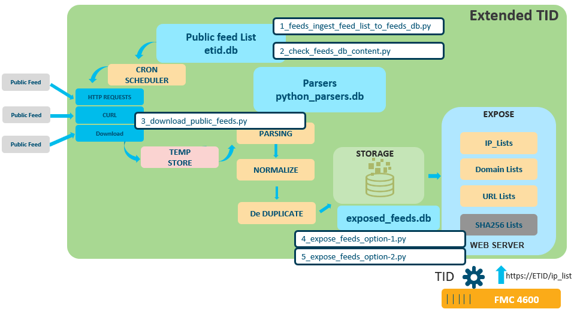

# Extended TID ( Threat Intelligence Director )

## What is Extended TID

ETID is a Public Security Feed Aggregator which downloads from the INTERNET ( or any other location ) Security Feeds, parses them, cleans them and finally expose them as a Web Service to FirePOWER Management Center Security Intelligence ( SI ) Feeds or to FMC Threat Intelligence Director ( TID ).

SI or TID are very easy and efficient ways to block access to thousands of malicious destinations. Just by creating a blocking list which contains all malicious destination to block.

But FMC SI or TID Feeds need that feed sources to respect a very clean text format. Another constraint is a maximum file size ( 500 KB ). And feed files must contain only one kind of observables : IP addresses, or Domains or URLs. We can't mix kind of observables into a source feed.

ETID collect all public feeds and does this formatting Job. That means that ETID becomes the Feed Source for FMC. 

ETID currently exposes 3 kind of Feeds :

- IP Addresses
- Domains
- URLs

These feeds are exposed to FMC by a embeded web server.

A characteristic of this version of ETID is that it uses SQLITE DBs for everythings we need to store ( feeds list, parsers parameters, outputs )
A reason for this is, in a next step, to make easy to embed the whole application into a FLASK or PHP web applications. And make easy to add new features based on the SQLi Database ( sorting, scoring, filtering, curation, etc...)

## Installation

Installing these scripts is pretty straight forward . You can just copy / and paste them into you python environment but a good practice is to run them into a python virtual environment.

### Install a Python virtual environment

	For Linux/Mac 

	python3 -m venv venv
	source bin activate

	For Windows 
	
	We assume that you already have installed git-bash.  If so open a git-bash console and :

	ptyhon -m venv etid_venv 
	source /etid_venv/Scripts/activate

### git clone the scripts

	git clone https://github.com/pcardotatgit/Extended_TID_version_2.git
	cd Extended_TID_version_2/
	
### install needed modules

ETID uses the following modules

- requests
- sqlalchemy
- pandas
- sqlite
- csv
- ipaddress
	
you can install them with the following  :
	
	pip install -r requirements.txt
	
## Extended TID Architecture

The picture here under presents the Extended TID internal Architecture 

	
## Running the scripts

### 0- Go to the <b>./files</b> directory and edit <b>feeds.txt</b> ( Optionnal )

Don't change anything in this file except the value  <b>1</b> or <b>0</b>  at the end of each lines

- 1 means : select this feed
- 0 means : ignore this feed

All these feeds had been tested ( March 2020 ) and work. 

In this version of ETID, parsers for every feeds in the feed list, had been embeded as predifined resources into the application.  You are not supposed to modify them 

By the way, if you want to create your own parser for a new feed, go to the **how_to_update_parsers** folder.

<b>Remark :</b> The last feed ( Toulouse black List ) is very big and takes more than 10 minutes to be parsed

### 1- Go to the <u>./scripts</u> Directory and run the <u>1_feeds_ingest_feed_list_to_feeds_db.py</u> ( Optionnal )

	#python 1_feeds_ingest_feed_list_to_feeds_db.py
	
The **1- feeds_ingest_feed_list_to_feeds_db.py** script allows you to select or unselect the public feeds you want be downloaded from the INTERNET.  
As you don't have directly access to the feed database, this script gives you this acces.  Allowing you to select and unselect feeds.
	
You must do this every time you modify the <b>feeds.txt</b> file

### 2- Check the feeds SQLite Database with the <u>2_check_feeds_db_content.py</u> ( Optionnal )

	#python 2_check_feeds_db_content.py
	
The 2_check_feeds_db_content.py script just displays the content of the feeds SQLite DB. 
The administrator can check thank to it which feeds are selected or not before starting the download step

### 3- Download the Public Feeds. Run the <u>3_download_public_feeds.py</u> script

	#python 3_download_public_feeds.py
	
This script is the core of the application. This is this script which updates the feeds to be exposed. It downloads all feeds contained into the feeds database, extract all observables from these feeds, and store them into SQLite Tables.

<b>Remark :</b> If you don't want to change the default feed list, you don't need to go thru the 3 first steps. You can directly run this script.
	
Depending on the number of feeds into the feed list and depending on their sizes, this downloading operation will take several minutes to complete.

The result of this operation is the storage of the clean feeds into 3 SQLI Tables. One for each kind of observables.  Observables are de duplicated into the tables.

This script is the core of the application. This is this script which updates the feeds to be exposed.

You will have to run it regularly ( once a day for example ). And the best to do so is to create a batch and add this batch to the CRON JOB list.

### 4- Expose the feeds.  

This is the last step.  You must do it in order to update the feeds exposed to FMC.

You can you 2 scripts for this :

	#python 4_expose_feeds_option-1.py :  Which generate into the ./clean_feeds directory 3 singles files. One for Each Kind of Feeds
	#python 4b_expose_feeds_option-2.py :  Which generate into the ./clean_feeds directory several files with a max size equal to 490KB max. Need for FMC
	
The chosen script must be runt just after the 3_download_public_feeds.py in order to make feed updates available for FMC.

### 5- And Of course don't forget to start the web server 

Run the <b>start_web_server.py</b> script located at the root of the ETID directory.

	#python start_web_server.py

The server listen on port 8888

Feeds are exposed at :  <b>http:// { ETID IP Address }:8888 /clean_feeds/{feed name }</b>

### 6- Automate Feeds updates

A good practice would be to update de the feeds periodically.  Once a day would be a good frequency.

To do so create a bash named : feed_update.sh into the Extended_TID_version_2 directory

	#!/bin/bash
	./ { path_to_etid }/Extended_TID_version_2/python 3_download_public_feeds.py
	./ { path_to_etid }/Extended_TID_version_2/python 5_expose_feeds_option-2.py

Make it executable

	chmod 777 ./{ path_to_etid }/Extended_TID_version_2/feed_update.sh
	
And then add a daily CRON job

	$ crontab -e
	
Add the following instruction

	@daily /{ path_to_etid }/Extended_TID_version_2/feed_update.sh
	
Save and close

That's it !
